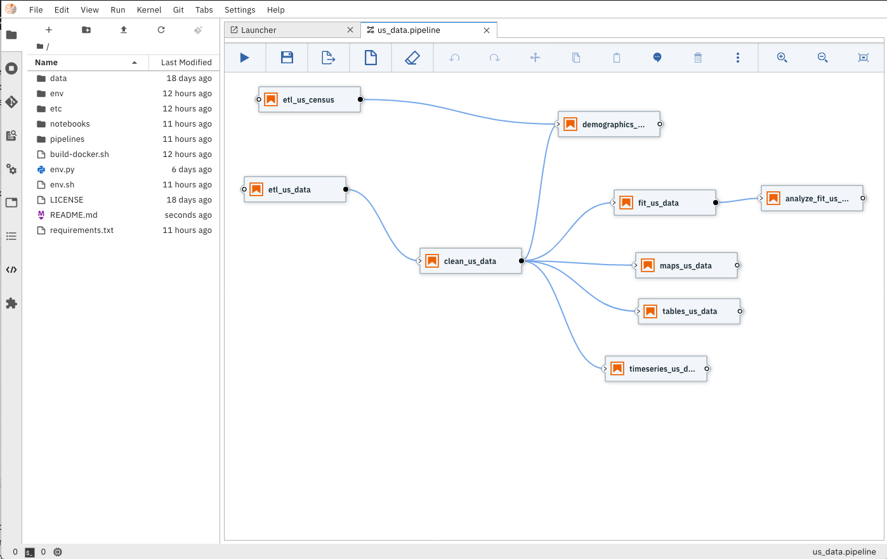
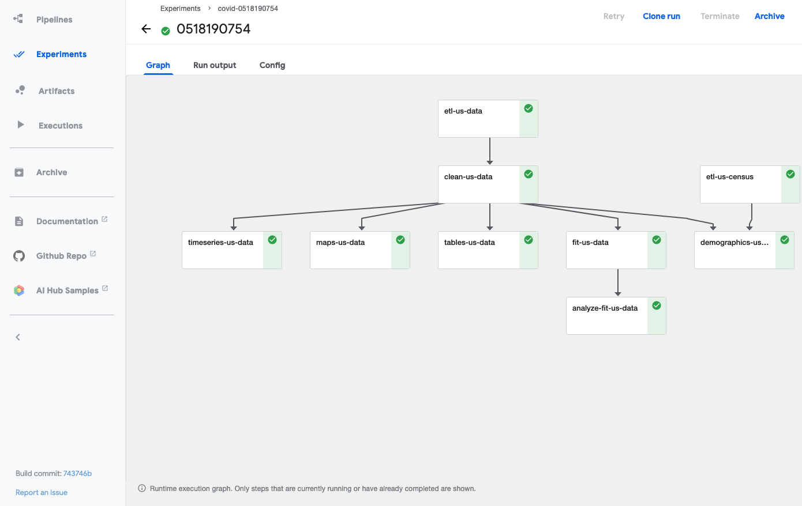
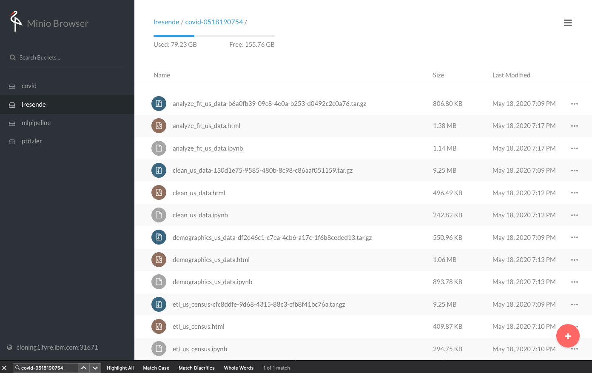

# Analyzing COVID-19 time series data

This repository provides a set of [Jupyter Notebooks](https://jupyter.org) that augment and 
analyze COVID-19 time series data.

While working on this scenario, we identified that building a pipeline would help organize the
notebooks and simplify running the full workflow to process and analyze new data. For this, we leveraged
[Elyra's](https://github.com/elyra-ai/elyra) ability to build 
[notebook pipelines](https://elyra.readthedocs.io/en/latest/getting_started/overview.html#notebook-pipelines-visual-editor)
to orchestrate the running of the full scenario on a [Kubeflow Pipeline](https://www.kubeflow.org/docs/pipelines/overview/pipelines-overview/)
runtime.



### Configuring the local development environment

**WARNING: Do not run these notebooks from your system Python environment.**

Use the following steps to create a consistent Python environment for running the
notebooks in this repository:

1. Install [Anaconda](https://docs.anaconda.com/anaconda/install/)
   or [Miniconda](https://docs.conda.io/en/latest/miniconda.html)
1. Navigate to your local copy of this repository.
1. Run the script `env.sh` to create an Anaconda environment in the directory `./env`:
   ```console
   $ bash env.sh
   ```
   Note: This script takes a while to run.
1. Activate the new environment and start JupyterLab:
   ```console
   $ conda activate ./env
   $ jupyter lab --debug
   ```

#### Configuring a local Kubeflow Pipeline runtime

[Elyra's Notebook pipeline visual editor](https://elyra.readthedocs.io/en/latest/getting_started/overview.html#notebook-pipelines-visual-editor)
currently supports running these pipelines in a Kubeflow Pipeline runtime.  If required, these are
[the steps to install a local deployment of KFP](https://elyra.readthedocs.io/en/latest/developer_guide/deploying-kubeflow-locally-for-dev.html).

After installing your Kubeflow Pipeline runtime, use the command below (with proper updates) to configure the new
KFP runtime with Elyra.

```bash
elyra-metadata install runtimes --replace=true \
       --schema_name=kfp \
       --name=kfp-local \
       --display_name="Kubeflow Pipeline (local)" \
       --api_endpoint=http://[host]:[api port]/pipeline \
       --cos_endpoint=http://[host]:[cos port] \
       --cos_username=[cos username] \
       --cos_password=[cos password] \
       --cos_bucket=covid
``` 

**Note:** The cloud object storage above is a local minio object storage but other cloud-based object storage 
services could be configured and used in this scenario.

## Elyra Notebook pipelines

Elyra provides a visual editor for building Notebook-based AI pipelines, simplifying the conversion of 
multiple notebooks into batch jobs or workflows. By leveraging cloud-based resources to run their 
experiments faster, the data scientists, machine learning engineers, and AI developers are then more productive,
allowing them to spend their time using their technical skills.


### Running the Elyra pipeline

The Elyra pipeline `us_data.pipeline`, which is located in the `pipeline` directory, can be run by clicking
on the `play` button as seen on the image above. The `submit` dialog will request two inputs from the user: a name 
for the pipeline and a runtime to use while executing the pipeline. The list of available runtimes comes from
the registered Kubeflow Pipelines runtimes documented above. After submission, Elyra will show a dialog with a direct
link to where the experiment is being executed on Kubeflow Piplines. 

The user can access the pipelines, and respective experiment runs, via the `api_endpoint` of the Kubeflow Pipelines
runtime (e.g. `http://[host]:[port]/pipeline`)



The output from the executed experiments are then available in the associated `object storage`
and the executed notebooks are available as native ipynb notebooks and also in html format
to facilitate the visualization and sharing of the results.



### References

Find more project details on [Elyra's GitHub](https://github.com/elyra-ai/elyra) or watching the
[Elyra's demo](https://www.youtube.com/watch?v=Nj0yga6T4U8).
    
